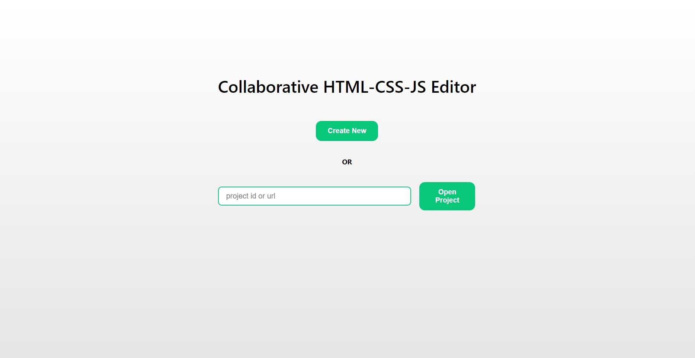
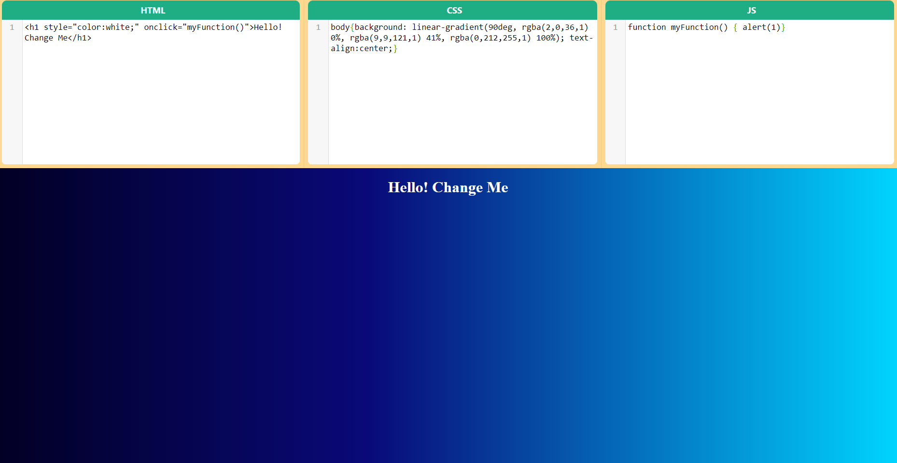

# Post Sharing with Push Notifs - Frontend

### Used Packages

**SocketIO:** socket io client (must be version 2)
**React Router v6**: routing package
**uuid4**: generate random uuid
**react-codemirror2 and codemirror**: code editor
**react-split-pane**: resizable divs


### How to run

#### clone the project: https://github.com/gurkanucar/collaborative-web-fe

```bash
  git clone https://github.com/gurkanucar/collaborative-web-fe
  cd collaborative-web-fe
```

#### install packages

```bash
  npm install
```

#### run app

```bash
  npm start
```

#### Note that!
if you connect from another device it'wont work. You have to change BASE_URL (localhost -> ip address)


## Example Images





### Example Video:

[https://www.youtube.com/watch?v=_BSXmWHKGEo](https://www.youtube.com/watch?v=_BSXmWHKGEo)

### Backend:

[https://github.com/gurkanucar/collaborative-web-be](https://github.com/gurkanucar/collaborative-web-be)
